# SEMRS Formal Organizational Chart

CEO-only reference (see CLAUDE.md's Agent Roles for each agent's actual
job description, and the Admin/System Settings dashboard view, which
displays this chart alongside the agent roster and system changelog).
Never shown to a client, and never included in anything compiled for a
client — this file exists purely for SEMRS's own internal structure.

This is a different grouping than CLAUDE.md's existing "Departmental
Chart" (Organizational Chart section) — that one groups by 10 informal
work areas for quick reference; this is the formal 17-agent,
7-department structure: the CEO (human authority) at the top, the
SEMRS OS Orchestrator (Managing Director — SEMRS's primary AI
controller) and Client Communication Agent as the front office beneath
the CEO, seven
departments beneath the Orchestrator (each showing which agents sit in
it), and the Analytics Agent reporting directly to the Orchestrator
rather than sitting inside any one department.

```mermaid
flowchart TD
    CEO["SEMRS CEO"]

    subgraph FRONT["Front Office"]
        direction LR
        ORCH["SEMRS OS Orchestrator<br/>Managing Director"]
        CC["Client Communication Agent<br/>Account Manager"]
    end

    CEO --> ORCH
    CEO --> CC

    subgraph RS["Research and Strategy"]
        direction TB
        RES["Research Agent"]
        SEOG["SEO & GEO Agent"]
        STRAT["Strategy Agent"]
    end

    subgraph CRE["Creative"]
        direction TB
        CONT["Content Agent"]
        VIS["Visual & Video Content Agent"]
    end

    subgraph QC["Quality and Compliance"]
        REV["Review Agent"]
    end

    subgraph DIST["Distribution"]
        direction TB
        WEB["Website/Blog Draft Agent"]
        SOC["Social Content Draft Agent"]
        WA["WhatsApp Draft Agent"]
        EM["Email Draft Agent"]
    end

    subgraph PM["Paid Media"]
        direction TB
        ADS["Ads Campaign Agent<br/>(ads-scoped orders only)"]
        SPEC["Ads Specialist Team — 10 internal specializations:<br/>Audience · Funnel · Copy · Landing Page · Tracking<br/>Platform · Optimization · Compliance · Budget Guard · Reporting<br/><i>not separate agents, logins, or roster entries</i>"]
        ADS --- SPEC
    end

    subgraph LG["Lead Generation and Sales"]
        direction TB
        LC["Lead Capture Agent<br/>(Lead Generation orders only)"]
        QS["Qualification + AI Sales Agent<br/>(scores + notifies client only —<br/>never contacts the lead)"]
    end

    subgraph SM["Self-Marketing"]
        SC["SEMRS Communicator Agent<br/>(semrs.com only, own approval track)"]
    end

    AN["Analytics Agent<br/>Reporting Analyst"]

    ORCH --> RS
    ORCH --> CRE
    ORCH --> QC
    ORCH --> DIST
    ORCH --> PM
    ORCH --> LG
    ORCH --> SM
    ORCH --> AN
```

## Notes
- **Front office (reports to CEO directly):** Orchestrator, Client
  Communication Agent.
- **Seven departments (report to Orchestrator):** Research and Strategy
  (Research, SEO & GEO, Strategy); Creative (Content, Visual & Video
  Content); Quality and Compliance (Review); Distribution (Website/Blog
  Draft, Social Content Draft, WhatsApp Draft, Email Draft); Paid Media
  (Ads Campaign — ads-scoped orders only — plus its 10-strong Ads
  Specialist Team, see below); Lead Generation and Sales
  (Lead Capture Agent, Qualification + AI Sales Agent — both run for
  any Lead Generation order; the AI Sales Agent scores and notifies the
  client only, never contacts the lead itself); Self-Marketing (SEMRS
  Communicator — semrs.com only, its own CEO approval track, never
  client work).
- **Analytics Agent** reports directly to the Orchestrator rather than
  sitting in any one department, since it reports across every channel
  a campaign actually used, not one department's output specifically.
- **Lead Capture Agent** and the **Qualification + AI Sales Agent** both
  run for any Lead Generation order once content/ads are live — there
  is no separate opt-in gating the AI Sales Agent's scoring/notification
  work (see CLAUDE.md, Lead Generation Track). It never messages, calls,
  or otherwise contacts the lead directly, with no exception; the
  client does all actual outreach and closing themselves, on their own
  WhatsApp Business account.
- All 17 agents are accounted for exactly once. Ads Campaign, the Lead
  Generation pair, and SEMRS Communicator remain conditional/on-demand
  agents (CLAUDE.md, Context) — shown here for organizational
  completeness, not implying they're active on every order.
- **The Ads Specialist Team is deliberately NOT counted in that 17.**
  `agents/` currently holds 27 job-description files, but 10 of them
  (Audience, Funnel, Ads Copy, Landing Page, Tracking, Ads Platform,
  Optimization, Compliance, Budget Guard, Ads Reporting) are internal
  specializations OF the Ads Campaign Agent — each file says so in its
  own header: "not a new top-level SEMRS OS agent, login, or roster
  entry." They are real, readable job descriptions that shape how ads
  work is actually done; they are not separate agents, and counting
  them as such would overstate this organization's real size. The
  17-agent / 7-department structure above is the top-level shape; the
  specialist team sits inside Paid Media.
- **Where each surface reads this from, so they can't drift apart:**
  SEMRS-Dashboard's Virtual Office and Agents Organization views read
  `agents/*.md` LIVE (`lib/specRepo.ts`), so a new JD file appears in
  both immediately — but its department must be declared in that file's
  `DEPARTMENT_BY_FILE` map, or it renders as "(unmapped)". That drift
  happened once, when these 10 files were added without the mapping;
  `tests/a11y/roster.spec.ts` in that repo now fails loudly if it
  recurs, rather than leaving it to be spotted by eye.
