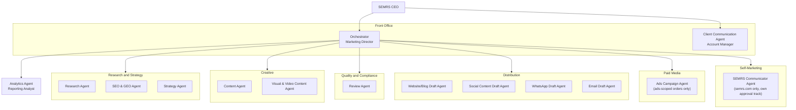

# SEMRS Formal Organizational Chart

CEO-only reference (see CLAUDE.md's Agent Roles for each agent's actual
job description, and the Admin/System Settings dashboard view, which
displays this chart alongside the agent roster and system changelog).
Never shown to a client, and never included in anything compiled for a
client — this file exists purely for SEMRS's own internal structure.

This is a different grouping than CLAUDE.md's existing "Departmental
Chart" (Organizational Chart section) — that one groups by 9 informal
work areas for quick reference; this is the formal 15-agent,
6-department structure: the CEO at the top, the Orchestrator and
Client Communication Agent as the front office beneath the CEO, six
departments beneath the Orchestrator (each showing which agents sit in
it), and the Analytics Agent reporting directly to the Orchestrator
rather than sitting inside any one department.

## Notes
- **Front office (reports to CEO directly):** Orchestrator, Client
  Communication Agent.
- **Six departments (report to Orchestrator):** Research and Strategy
  (Research, SEO & GEO, Strategy); Creative (Content, Visual & Video
  Content); Quality and Compliance (Review); Distribution (Website/Blog
  Draft, Social Content Draft, WhatsApp Draft, Email Draft); Paid Media
  (Ads Campaign — ads-scoped orders only); Self-Marketing (SEMRS
  Communicator — semrs.com only, its own CEO approval track, never
  client work).
- **Analytics Agent** reports directly to the Orchestrator rather than
  sitting in any one department, since it reports across every channel
  a campaign actually used, not one department's output specifically.
- All 15 agents are accounted for exactly once. Ads Campaign and SEMRS
  Communicator remain conditional/on-demand agents (CLAUDE.md,
  Context) — shown here for organizational completeness, not implying
  they're active on every order.
